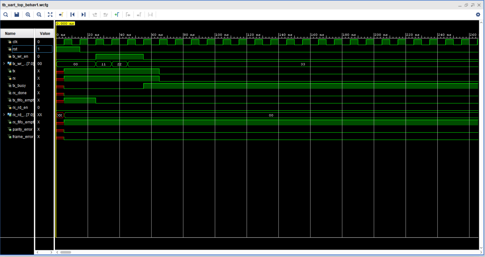

# UART Controller in Verilog
A fully functional parameterized UART transmitter/receiver with TX/RX FIFOs, 
simulated and synthesised in Xilinx Vivado 2017.4.

## Project Summary
| Item | Detail |
|------|--------|
| Architecture | Independent TX/RX FSMs with shared 16x-oversampling baud generator |
| TX FSM | 5 states: IDLE → START → DATA → [PARITY] → STOP |
| RX FSM | 5 states: IDLE → START → DATA → [PARITY] → STOP, 16x oversampled |
| FIFOs | 4-word synchronous FIFO, one for TX path, one for RX path |
| Parity | Configurable via `PARITY_MODE` parameter (0=none, 1=even, 2=odd) |
| Bit Order | LSB-first |
| Target Device | Xilinx Artix-7 xc7a35tcpg236-1 |
| Synthesis Result | 92 LUTs, 89 Flip-Flops, 0 BRAM, 0 DSP |
| Tool | Xilinx Vivado 2017.4 |

## Protocol Details
| Parameter | Value (testbench config) |
|-----------|---------------------------|
| Oversampling | 16x baud rate |
| Frame format | 1 start bit, 8 data bits, [parity bit], 1 stop bit |
| Start bit validation | Sampled mid-bit (tick 7) and confirmed at tick 15 before transitioning to DATA |
| Data sampling | Mid-bit sampling (tick 7) per bit, 16 ticks per bit period |
| False-start rejection | RX returns to IDLE if line isn't still low at tick 7 of START |

## Modules
| File | Description |
|------|-------------|
| `baud_gen.v` | Clock divider producing 16x baud tick, parameterized via `CLK_FREQ`/`BAUD_RATE` |
| `uart_tx.v` | Transmitter FSM — IDLE→START→DATA→[PARITY]→STOP, configurable parity, LSB-first |
| `uart_rx.v` | Receiver FSM — 16x oversampling, false-start rejection, mid-bit sampling |
| `fifo.v` | 4-word synchronous FIFO, 3-bit pointer with MSB-wraparound full/empty detection |
| `uart_top.v` | Top-level integration — TX/RX FIFOs, baud_gen, uart_tx, uart_rx, processor-facing interface |
| `tb_uart_top.v` | Self-checking integration testbench — multi-byte loopback verification |

## Simulation Results
Self-checking testbench output — all 4 integration tests passing:

===== UART TOP INTEGRATION TEST =====

Writing 3 bytes to TX FIFO: 0x11, 0x22, 0x33
Reading back from RX FIFO...
               `Byte 0: PASS | received=0x11  expected=0x11`
               `Byte 1: PASS | received=0x22  expected=0x22`
               `Byte 2: PASS | received=0x33  expected=0x33`
Error Flags Test: PASS | no parity or frame errors

======================================

ALL 4 TESTS PASSED

## Waveform

*Three bytes (0x11, 0x22, 0x33) written back-to-back to the TX FIFO, transmitted 
serially via loopback into RX, and read back from the RX FIFO in order. 
Each frame is ~16,000ns (10 bit periods × 1600ns). Clock period and baud rate 
parameterized for fast simulation (CLK_FREQ=16000, BAUD_RATE=100).*

## Resume Bullet
> Designed and verified a parameterized UART controller in Verilog with 
> independent TX/RX FSMs, 16x oversampling, and synchronous FIFOs; built a 
> self-checking testbench that caught 4 real RTL/verification/toolchain bugs 
> including FIFO handshake races, a start-bit sampling error, and a Vivado 
> synthesis incompatibility; synthesised on Xilinx Artix-7 
> (xc7a35tcpg236-1) using 92 LUTs and 89 flip-flops in Vivado 2017.4 with 
> zero BRAM/DSP usage.
